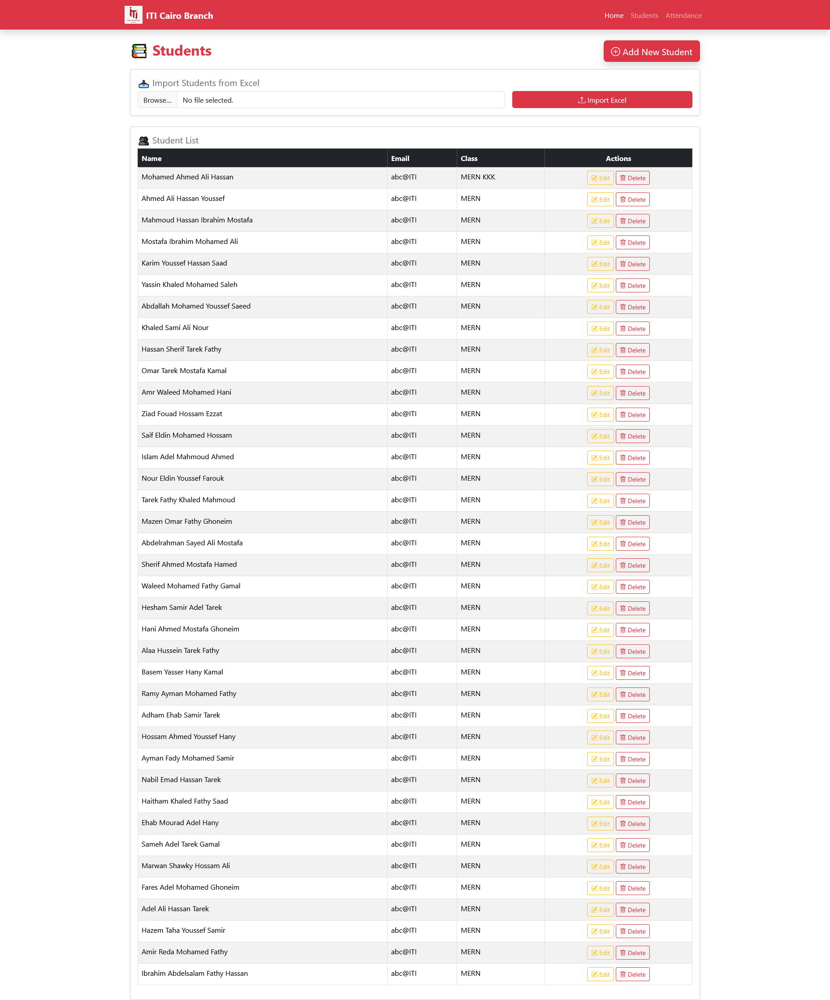
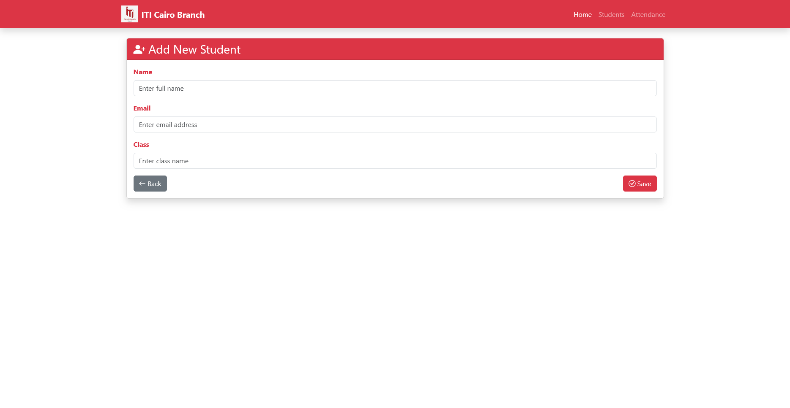
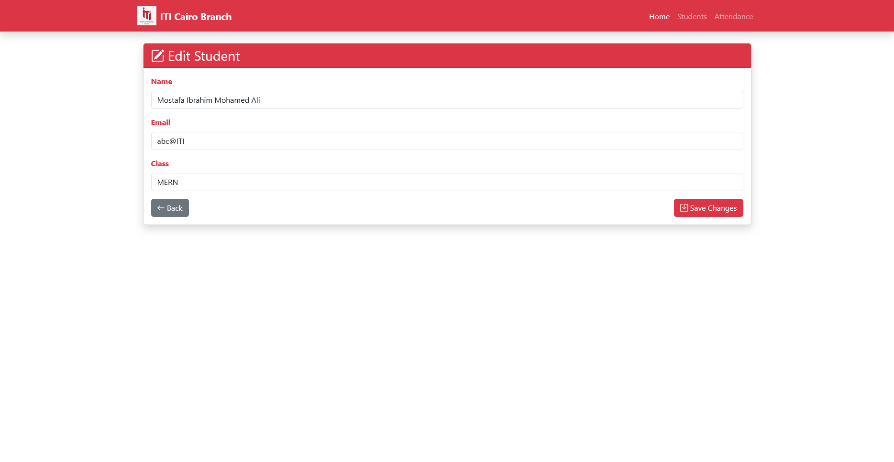
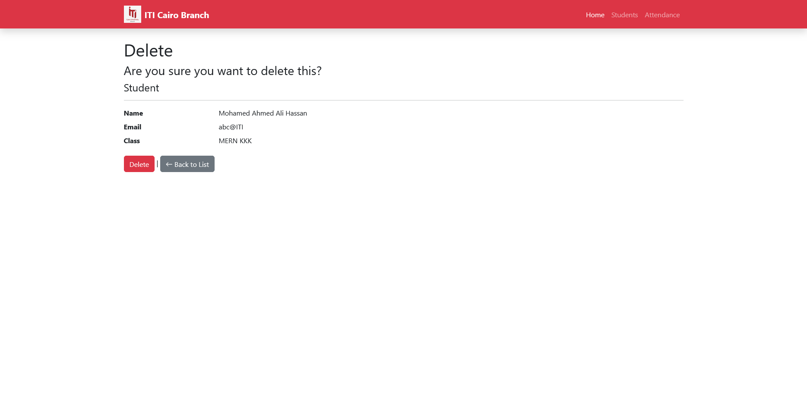
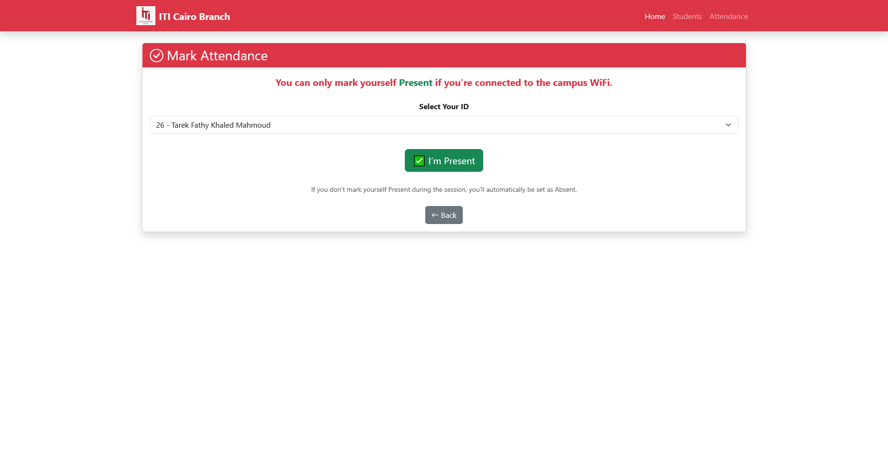
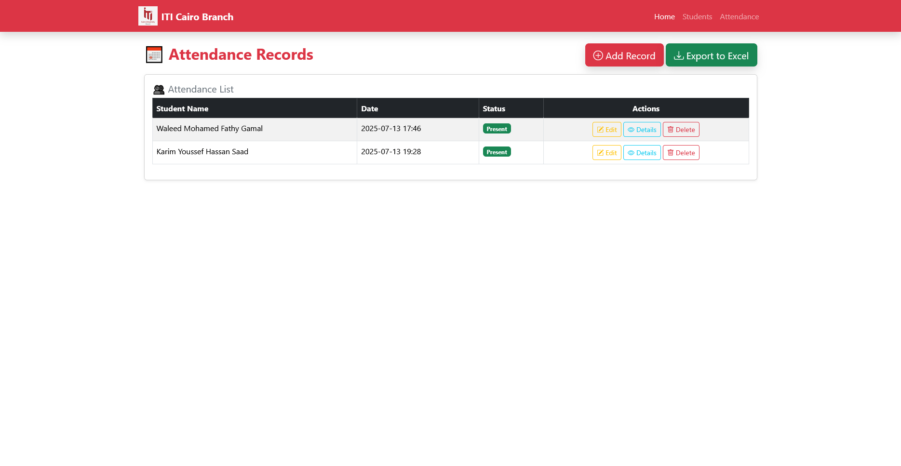
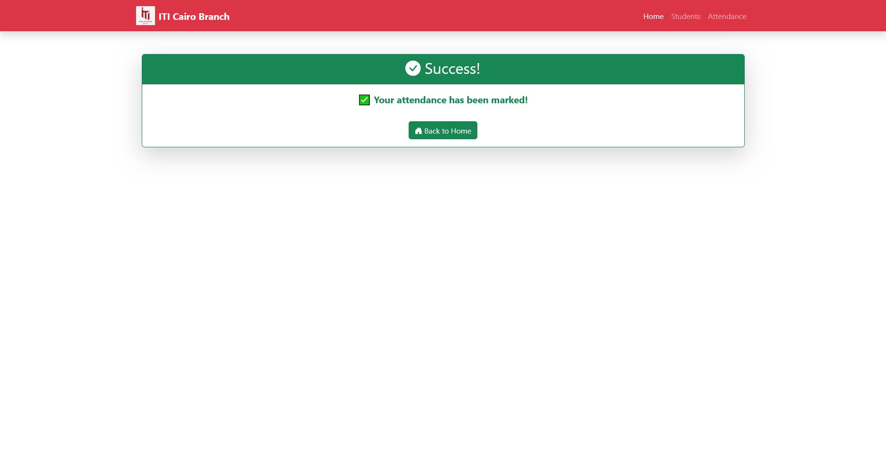

# 📚 Student Attendance App

A modern ASP.NET Core MVC application to manage student attendance with Excel import/export and WiFi/IP verification.

---

## 🚀 Features
✅ Manage students and attendance records.  
✅ Import/export data to Excel (using ClosedXML).  
✅ WiFi-based attendance validation to ensure students are present on campus.  
✅ Clean, modern UI inspired by ITI Cairo branding.  
✅ SQL Server integration.

---

## 🛠 Tech Stack
- **Backend**: ASP.NET Core MVC (.NET 8)
- **Database**: SQL Server
- **Frontend**: Bootstrap 5 + Razor Views
- **Excel Handling**: ClosedXML
- **WiFi/IP Validation**: Custom Helper

---

## 📷 Screenshots

### 🏠 Home Page


### 👩‍🎓 Students Page


### ➕ Add New Student


### ✏️ Edit Student


### 🗑️ Delete Student


### 📅 Mark Attendance


### 📖 Attendance Records


### ✅ Success Notification


### ❌ Error Page


## 💻 Installation

### 🧑‍💻 Clone the repo:
```bash

https://github.com/MohabIslam/StudentAttendanceApp


